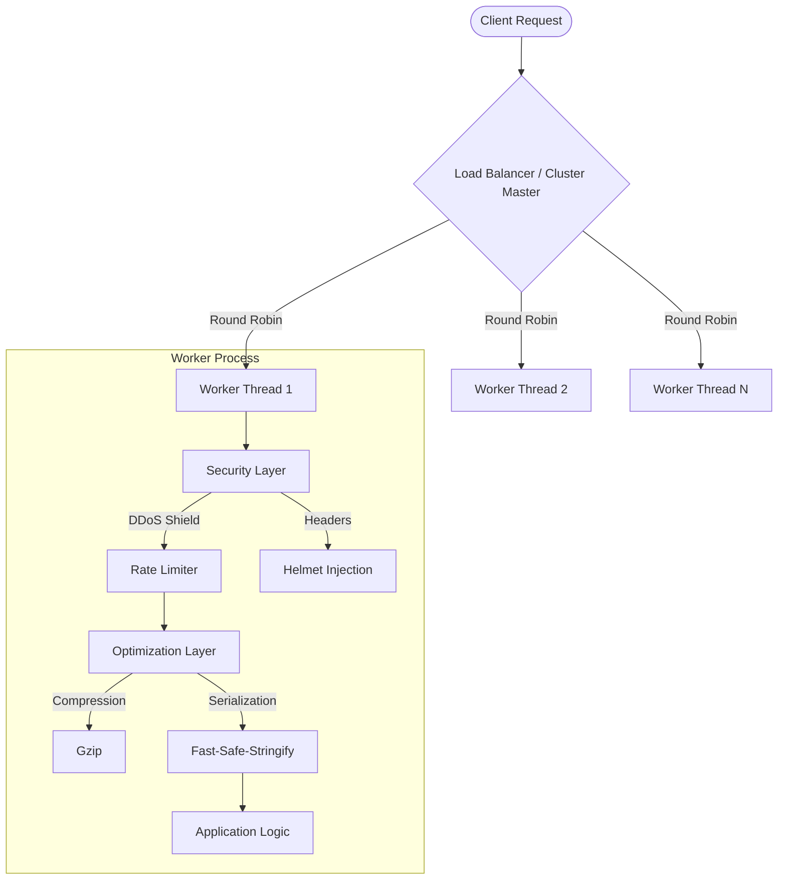

# coders.api

<div align="center">

CodersAPI

**Enterprise-Grade Node.js Framework for Scalable Microservices**

[](https://opensource.org/licenses/ISC)
[](https://nodejs.org)
[]()


</div>

---

## 🛠️ Overview

**coders.api** is a prescriptive, high-availability Node.js framework engineered for performance-critical applications. Built on top of Express, it abstracts the complexity of configuring secure, clustered, and optimized server environments.

Designed for developers who demand **production-readiness** from day one, it integrates advanced security protocols, real-time observability, and V8 engine optimizations into a cohesive, zero-config runtime.

---

## 🛠️ Architecture

The framework operates on a multi-tiered architecture designed to maximize throughput and resilience.



### Design Philosophy
1.  **Security by Default**: Security features (CORS, Helmet, Rate-Limiting) are not opt-in; they are foundational.
2.  **Performance First**: We bypass standard bottlenecks by utilizing `spdy` (HTTP/2), direct V8 flag manipulation (`--harmony`), and `fast-safe-stringify` for JSON operations.
3.  **Resiliency**: A custom "Crash Shield" wraps the event loop to catch `uncaughtException` and `unhandledRejection`, ensuring 99.9% uptime even during critical application errors.

---

## 💎 Core Features

### 🛡️ Proactive Threat Mitigation
*   **Algorithmic DDoS Protection**: A heuristic engine analyzes request intervals (Δt < 500ms) to identify and block abusive IP patterns at the socket level.
*   **Header Hardening**: Automatically implements OWASP-recommended headers (`Content-Security-Policy`, `X-Content-Type-Options`, `X-Frame-Options`).
*   **Socket-Level Isolation**: Malicious connections are destroyed immediately to preserve file descriptors.

### ⚡ V8 & Network Optimization
*   **HTTP/2 Multiplexing**: Native support for HTTP/2 allows concurrent data transmission over a single TCP connection.
*   **JIT Warmup**: The framework executes synthetic JSON serialization cycles during startup to force V8 Inline Caching (IC) optimization before the first real request hits.
*   **Adaptive Compression**: Response bodies are automatically compressed using Gzip, but only when the payload size justifies the CPU cost (>1KB).

### ☁️ Distributed Clustering
*   **Zero-Downtime Scaling**: Enabling `cloud: true` triggers the `cluster` module, forking worker processes equivalent to the number of physical CPU cores.
*   **Automatic Resurrection**: The Master process monitors worker health and instantaneously respawns any worker that terminates unexpectedly.

---

## ☁️ Cloud Mode Deep Dive

In a standard Node.js environment, your server runs on a single thread, utilizing only one CPU core. **Cloud Mode** transforms your application into a distributed system that leverages 100% of your hardware's potential.

### Why use Cloud Mode?
- **Infinite Throughput**: By running a worker on every core (e.g., 8-core CPU = 8 workers), you effectively multiply your request handling capacity by the number of cores.
- **Self-Healing Infrastructure**: If a worker process crashes due to a bug or memory leak, the **Master Process** detects it immediately and forks a new replacement worker in milliseconds.
- **Zero Configuration**: No need for complex process managers like PM2. Everything is handled natively within the framework.

### How to Enable
Pass the `cloud: true` flag in the constructor or the `.start()` method.

```javascript
const app = new CodersAPI({
    cloud: true // Automatic clustering
});

// OR enable it during startup
app.start(3000, { cloud: true });
```

### Under the Hood
1. **Master Process**: Does not handle requests. It manages workers, monitors system resources, and orchestrates the load balancer.
2. **Worker Processes**: Independent instances of your app that share the same server port. Incoming traffic is distributed among them using a Round-Robin algorithm.
3. **IPC Communication**: Workers can communicate with each other or the Master for shared state management.

---

## 🛠️ API Reference

### Initialization
```javascript
const CodersAPI = require('coders.api');

const server = new CodersAPI({
    port: 3000,
    name: 'Production-API',
    cloud: true,          // Enable Multi-Core Clustering
    telemetry: true       // Enable CLI Ops Dashboard
});

server.start();
```

### Advanced Routing
The framework introduces a `Group` pattern to maintain clean architecture in large codebases.

```javascript
server.group('/api/v2', (router) => {
    // Middleware specific to this group
    router.use(AuthMiddleware);

    // POST /api/v2/transactions
    router.post('/transactions', server.validate(['amount', 'currency']), (req, res) => {
        // Business Logic
        res.ok({ txId: 'tx_123' });
    });
});
```

### Request Context Helpers
Standard `res` objects are augmented with semantic utility methods.

| Method | Signature | Description |
| :--- | :--- | :--- |
| `res.ok` | `(data: any, msg?: string)` | Standard Success (200). Automatically stringifies data safely. |
| `res.fail` | `(msg: string, code?: number)` | Standard Error. Defaults to 400 Bad Request. |
| `res.flat` | `(buffer: Buffer)` | Streams binary data with correct content-type inference. |

---

## 🔐 Advanced Authentication (Built-in)

CodersAPI includes an enterprise-grade authentication system ready for SaaS development.

### JWT Authentication
Generate and verify tokens with ease.
```javascript
// Sign a token
const token = app.sign({ id: 123, role: 'admin' });

// Protect a route
app.get('/admin/stats', app.guard(['admin']), (req, res) => {
    res.ok({ stats: '...' });
});
```

### API Key Protection
Ideal for B2B APIs or third-party integrations.
```javascript
app.get('/data', app.apiKeyGuard(['key_123', 'key_456']), (req, res) => {
    res.ok("Secure Data");
});
```

### User-Specific Rate Limiting
Prevent users from abusing your API. Works with JWT or IP.
```javascript
// Limit to 10 requests per minute for this specific route
app.get('/expensive-task', app.guard(), app.userRateLimit(10), (req, res) => {
    res.ok("Task complete");
});
```

---

## 🧩 Plugin System

CodersAPI features a modular plugin system that allows you to extend the framework's core functionality without modifying its internal code.

### Using a Plugin
```javascript
const myPlugin = (instance, options) => {
    // Access the express app
    instance.app.use((req, res, next) => {
        console.log(`Plugin says: ${options.message}`);
        next();
    });
};

app.usePlugin(myPlugin, { message: 'Hello from Plugin!' });
```

### Official Plugins (Coming Soon)
- `@coders.api/auth`: Robust JWT and OAuth2 integration.
- `@coders.api/metrics`: Prometheus and Grafana support.
- `@coders.api/db`: Automated ORM and Database connection management.

---

## 📊 Observability

For local development and monitoring, `coders.api` includes a terminal-based dashboard built with `blessed-contrib`.

*   **Metric Ingestion**: Real-time tracking of Request Per Second (RPS) and latency.
*   **Resource Profiling**: Live CPU usage visualization.
*   **Security Auditing**: A visual gauge of currently blocked IP addresses.

To enable, simply pass `{ telemetry: true }` in the constructor.

## 💻 Official CLI

CodersAPI comes with an integrated CLI to speed up your development workflow.

### Installation
The CLI is included automatically when you install the package. To use it globally, you can link it or install with `-g`.

### Commands
*   `coders.api init`: Automatically generates a boilerplate `index.js` and `.env` file.
*   `coders.api start`: Launch the server in production mode.
*   `coders.api dev`: Launch with automatic restart (uses `nodemon` if available).
*   `coders.api status`: Show real-time CPU, RAM, and system information.
*   `coders.api env`: List important environment variables (masked for security).
*   `coders.api info`: Display project information and GitHub links.
*   `coders.api --version`: Check the framework version.

```bash
# Initialize a new project
$ coders.api init

# Start dev mode
$ coders.api dev

# Check system health
$ coders.api status
```

---

## 🚀 Getting Started

1.  **Install the dependency**:
    ```bash
    npm install coders.api
    ```

2.  **Create your entry point (`main.js`)**:
    ```javascript
    const CodersAPI = require('coders.api');
    const service = new CodersAPI({ port: 8080 });
    
    service.get('/health', (req, res) => res.ok("System Operational"));
    
    service.start();
    ```

---

## 📄 License & Contribution

This project is currently proprietary but is scheduled for an **Open Source** release under the **ISC License**.
We welcome code reviews, pull requests, and architectural discussions.

<div align="center">
    <sub>Build with ❤️ by Coders</sub>
    <sub>Engineered with precision. 2026.</sub>
</div>
